## 高级内存 Memory

### 值类型和引用类型的区别

##### 名词

值类型 / 基础类型

引用 Reference / 指针 Pointer / 对象变量

##### 通用原则

赋值的是数据格里的数据

### 基础类型 Primitive Types

##### 案例

```java
int a = 3;
int b = 4;
a = b;
a = 5
```

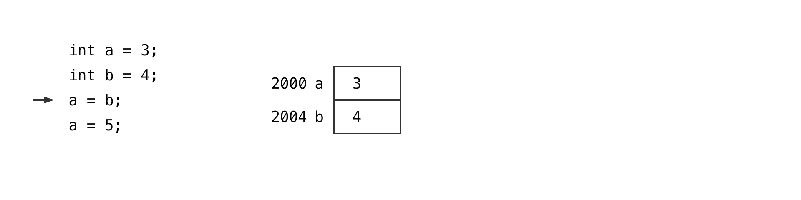

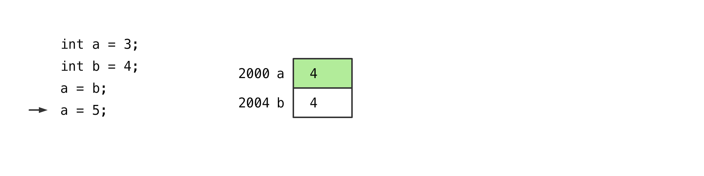

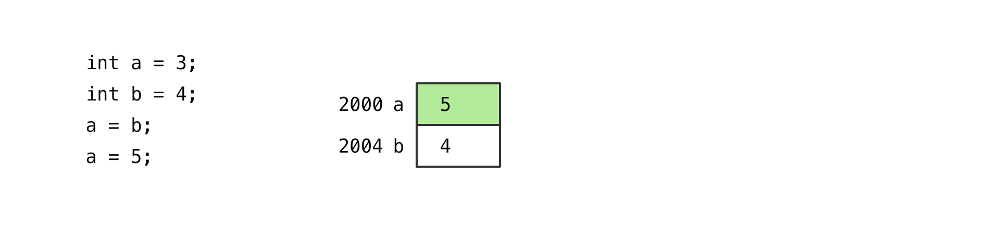

###### 效果

赋值 是 复制

###### 有哪些

八大基础类型

##### 规则

每个变量都会在内存中开辟空间, 获得一个地址

###### 地址

空间在内存中的位置

###### 变量名

具体地址的昵称

###### 三项

地址, 变量名, 值

### 结构体类型 Structure Types

##### 案例

```c
Point p1 = Point(3, 4);
Point p2 = Point(5, 6);
p1 = p2;
p1.x = 7;
```

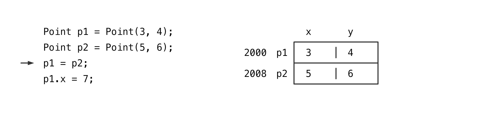

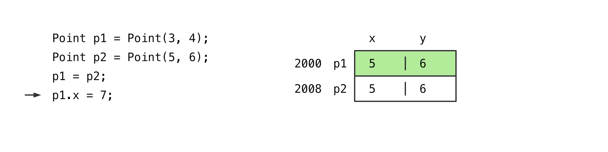

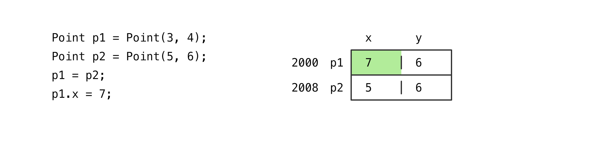

###### 效果

赋值 是 复制

###### 有哪些

C, C++ 的语法, Java 里不存在这个现象

### 对象类型 Class Types

##### 案例

```java
Point p1 = new Point(3, 4);
Point p2 = new Point(5, 6);
p1 = p2;
p1.x = 7;
```

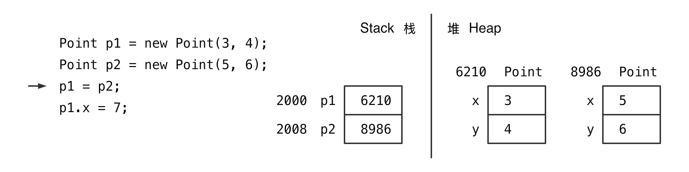

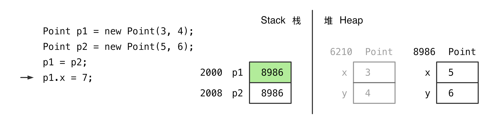

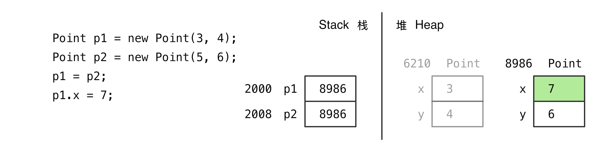

###### 效果

赋值 不会 复制

###### 有哪些

非基础类型: 对象, 数组, 字符串 ...

##### 堆栈

###### 什么是

两个内存空间

堆 Heap

栈 Stack

###### 规则

新建的对象开在 堆里

属性 开在 堆里的对象里

局部变量 开在 栈里

##### 指针

###### 什么是

一个变量里存的值, 正好是另外一个变量的地址

###### 引用

Java 里叫引用

对象变量里存储的是一个对象的引用

##### `.` 运算符

###### 干嘛的

做内存跳转使用

##### 网红和手机号

网红 是 对象

手机号 是 对象的引用

传输和复制的是 手机号, 不是网红

对 网红做出的任何修改, 大家都看得到

### 对象 与 内存

##### 对象和对象变量

对象变量里存的是对象的引用

对象变量赋值, 赋值的是对象变量里的内容

```java
Point p1 = new Point(3, 4);
Point p2 = new Point(5, 6);
Point p3 = p2;
```

有几个对象, 几个对象变量

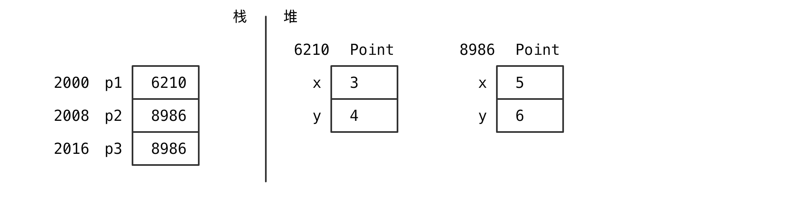

###### 意义

p3 是 p2 所指向对象的昵称

##### 数组是对象

数组是对象, 数组变量 是数组的对象变量

```java
int[] arr = new int[3];
int[] arr2 = arr;
arr2[0] = 3;
```

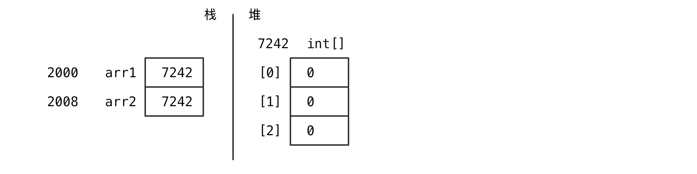

##### 对象数组

数组是 一堆数据格

对象类型的数组 是一堆 对象的数据格, 没有对象

对象数组可以用于存储对象

```java
int[] arr = new int[3];
arr[0] = 2;    

Point[] points = new Point[3];
points[0] = new Point(3, 4);
```

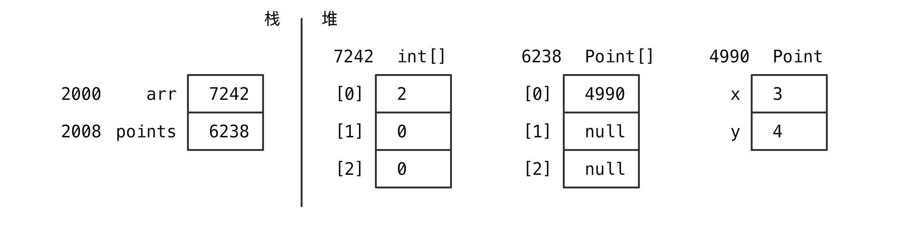

##### 对象比较

###### 案例

```java

Point p1 = ...;
Point p2 = ...;
```

比较两个对象是不是一样?

一个对象? 值一样的两个对象?

###### 分析

如果 `p1 == p2` 证明 `p1` `p1` 指向的是一个对象, 必然相等

如果 `p1 != p2` 也不能代表 `p1` 和 `p2` 的内容是不一样的

###### 代码

```java
public class Point {
    public boolean equalsTo(Point point) {        
        if (point == null) {            
            return false;        
        }                    
        if (point == this) {            
            return true;        
        }                    
        return x == point.x && y == point.y;    
    }
}
```

##### 对象拷贝

###### 案例

```java
public class Graph {
    public void run(){        
        Point p1 = new Point(3, 4);        
        Point p2 = p1;    
    }
}
```

对象变量赋值 赋值的是引用, 对象并没有被复制

如果需要赋值, 则需要拷贝对象

###### 一般拷贝方法

```java
public class Point {
    public Point copy() {        
        return new Point(x, y);    
    } 
}

public class Graph {
    public void run(){
        Point p1 = new Point(3, 4);        
        Point p2 = p1.copy();    
    } 
}
```

###### 拷贝构造

```java
public class Point {    
    public Point(Point point){        
        x = point.x;        
        y = point.y;    
    }   
}
public class Graph {
    public void run(){        
        Point p1 = new Point(3, 4);        
        Point p2 = new Point(p1);    
    }
}
```

### 内存堆栈结构

[下载源代码](./code/memory.zip)

##### 内存开辟规则

###### 创建新对象

在堆里依据类声明中的属性，开空间

###### 变量声明

局部变量 和 参数变量 在栈里开空间

##### 内存查找规则

###### 取值时

所有变量都 从栈里 开始找

如果栈里没有, 试图补 this

##### 方法调用规则

###### 方法调用时

1 增加 隔板

2 传输 this

3 传输 参数

###### 调用结束时

1 删除 所有变量

2 传输 返回值

3 去掉 隔板

##### 高级 debug

查看 debug 面板

查看变量

##### 方法内使用的资源

属性变量

局部变量

参数变量